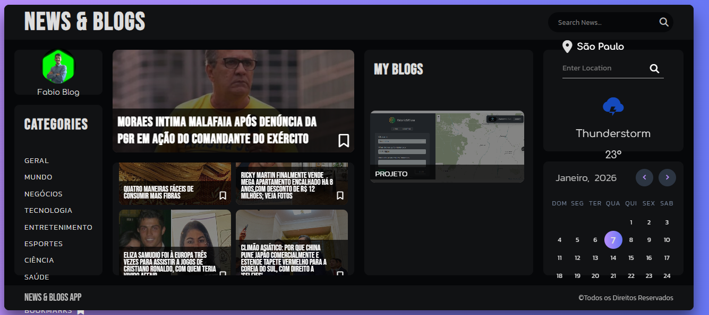

# 📰 News & Blog App

Aplicação web moderna de **Notícias e Blog**, desenvolvida com **React**, que consome a API **GNews** para exibir notícias atualizadas em **Português do Brasil**. O projeto conta com busca por palavras-chave, filtro por categorias e leitura detalhada das notícias.

---

## 📸 Preview
Interface limpa, moderna e responsiva, focada na leitura de notícias e artigos.


---

## 🚀 Funcionalidades

- 📰 Listagem de notícias em tempo real  
- 🔍 Busca por palavras-chave  
- 🗂️ Filtro por categorias  
- 🖼️ Imagem padrão quando a notícia não possui imagem  
- 📖 Leitura da notícia em modal  
- ⭐ Sistema de favoritos (Bookmarks) com LocalStorage  
- 🇧🇷 Conteúdo em Português do Brasil  
- 📱 Interface responsiva  

---

## 🛠️ Tecnologias Utilizadas

- React.js  
- Axios  
- GNews API  
- CSS3  
- LocalStorage  

---

## ⚙️ Como executar o projeto

```bash
git clone https://github.com/seu-usuario/news-blog-app.git
cd news-blog-app
npm install
VITE_GNEWS_API_KEY=SUA_API_KEY_AQUI
npm run dev


